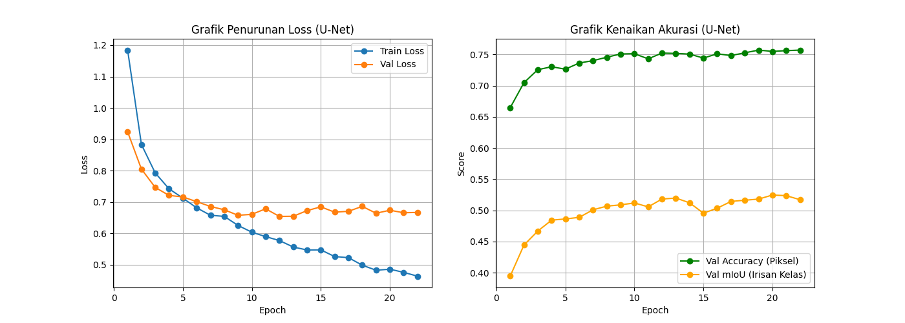
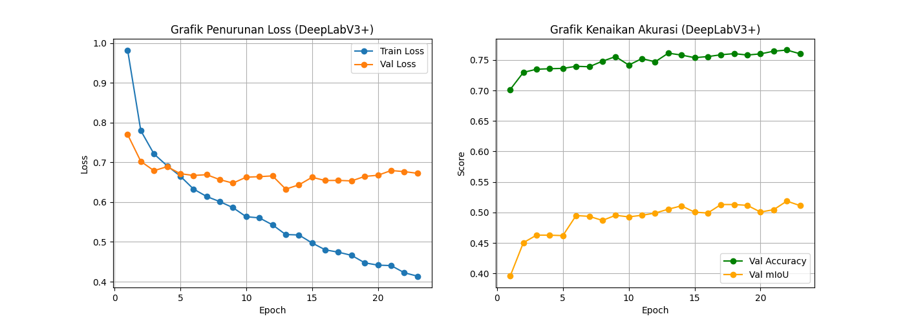
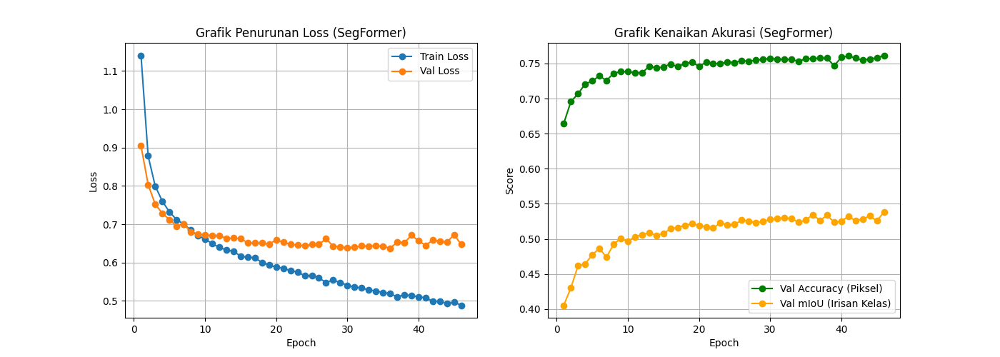
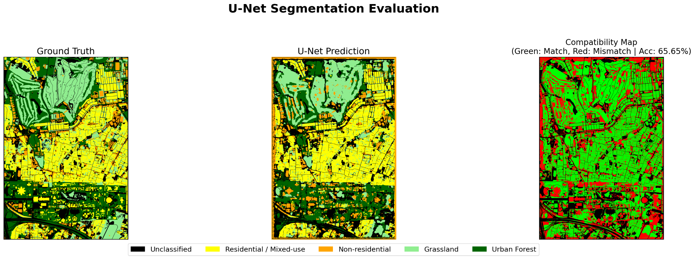
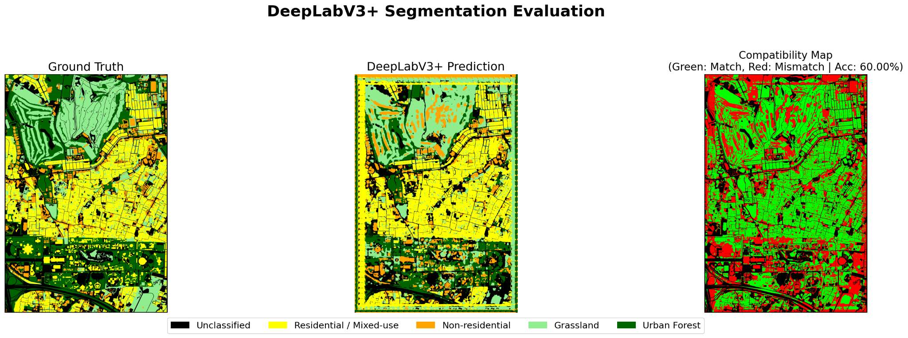
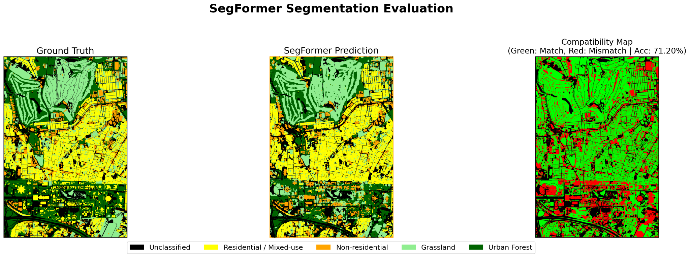
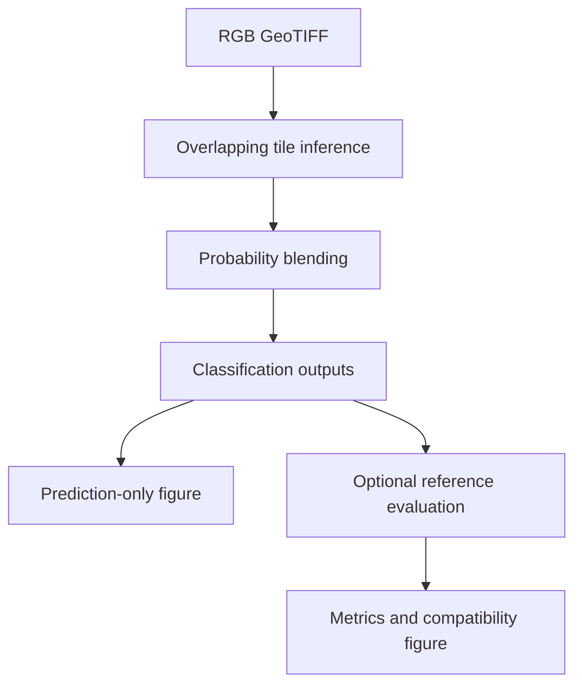

# VHR Satellite Segmentation Pipeline

Deep-learning segmentation of selected urban land-cover classes from 30 cm very-high-resolution RGB satellite imagery using U-Net, DeepLabV3+, and SegFormer.

<!--
HERO GIF SLOT
Place the final animation at: docs/assets/hero_before_after.gif
Recommended content: a horizontal sliding comparison between satellite imagery and the classified result.
Replace this comment with:
<p align="center">
  
</p>
-->

## Description

This project maps four target classes from an RGB satellite image:

1. residential / mixed-use built-up;
2. non-residential built-up;
3. grassland;
4. urban forest, green belt, and urban park.

Every remaining object is assigned to `Unclassified / Other`. Examples include water bodies, plantations, open land, and other objects outside the four target classes. Class `0` is therefore a valid semantic class, not a training background label.

> **Temporary reproducibility notice:** the current repository snapshot cannot complete the demo because the redistributable demo imagery and reference layer are still awaiting upload by the author. All commands and paths already follow the intended final demo package.

## Intended Use and Geographic Limitation

The models were trained using dense residential landscapes in Jakarta. Building density, roof materials, street patterns, vegetation structure, illumination, season, sensor characteristics, and image resolution can differ substantially in another location.

Prediction quality may decrease in suburban, rural, agricultural, industrial, or geographically distant areas. A visually unfamiliar object can also be assigned to the closest learned class. **Testing on a small labeled sample is strongly recommended before large-area processing** outside dense Jakarta-like urban environments.

## Main Features

### 1. Three segmentation models

The same workflow supports U-Net, DeepLabV3+, and SegFormer.

### 2. Large-raster inference

The raster is processed with `512 × 512` tiles, a `256` pixel stride, 50% overlap, reflect padding at image edges, and probability averaging inside overlap areas.

### 3. Reference evaluation

Inference can run with imagery only. A reference vector is required only for accuracy, precision, recall, F1-score, IoU, and confusion-matrix calculation. Reference-covered pixels from all five classes, including `Unclassified / Other`, are included in evaluation.

### 4. GIS-ready output

The classification is saved as a georeferenced GeoTIFF and converted into a GeoPackage (.gpkg) polygon layer. Shapefile (.shp) output is also supported.

### 5. Visual results

Prediction-only mode creates a classified-map PNG. Evaluation mode creates ground-truth, prediction, and compatibility panels.

## Models

| Model | Backbone | Command name | Weight filename |
|---|---|---|---|
| U-Net | ResNet34 | `unet` | `unet_resnet34.pth` |
| DeepLabV3+ | ResNet50 | `deeplabv3plus` | `deeplabv3plus_resnet50.pth` |
| SegFormer | MiT-B0 | `segformer` | `segformer_mit_b0.pth` |

## Class Definitions

| Class ID | Class name | Definition and examples |
|---:|---|---|
| 0 | Unclassified / Other | Valid semantic catch-all for objects outside classes 1–4, including water bodies, plantations, open land, and other unsupported objects |
| 1 | Residential / Mixed-use Built-up | Built-up land used primarily for housing or residential activity, including mixed residential use |
| 2 | Non-residential Built-up | Built-up land not used as housing, such as hospitals, government offices, schools, and other institutional or service buildings |
| 3 | Grassland | Grass-covered land and similar low vegetation |
| 4 | Urban Forest / Green Belt / Urban Park | Tree-dominated urban green areas, green corridors, and city parks |

The model contains five output channels. Four thematic targets use IDs `1–4`, while class `0` collects all remaining land-cover objects.

## Repository Structure

```text
vhr-satellite-segmentation-pipeline/
├── README.md                          # Project overview
├── LICENSE                            
├── requirements.txt                   
├── .gitignore                         
│
├── scripts/
│   └── run_demo.py                    # Main command-line
│
├── src/                               # Reusable inference pipeline
│   ├── __init__.py                    
│   ├── models.py                      # Model construction and checkpoint loading
│   ├── inference.py                   # Tiling, padding, prediction, and GeoTIFF export
│   ├── vectorize.py                   # Classification raster to vector
│   ├── evaluate.py                    # Calculate metrics evaluation
│   └── visualize.py                   # Prediction and evaluation PNG figures
│
├── demo/                              # Demonstration assets
│   ├── imagery_demo.tif               # Demo RGB satellite raster
│   ├── reference_demo.gpkg            # Demo evaluation reference
│   └── README.md                      
│
├── weights/                           # Locations for trained checkpoints
│   ├── unet_resnet34.pth              # U-Net checkpoint
│   ├── deeplabv3plus_resnet50.pth     # DeepLabV3+ checkpoint
│   ├── segformer_mit_b0.pth           # SegFormer checkpoint
│   └── README.md                      
│
├── results/                           # Experiment reports
│   ├── benchmark.csv                  # Private-scene evaluation summary
│   └── figures/                       # Training and evaluation figures
│       ├── grafik_training_unet.png
│       ├── grafik_training_deeplab.png
│       ├── grafik_training_segformer.png
│       ├── unet_evaluation_research.png
│       ├── deeplabv3plus_evaluation_research.png
│       ├── segformer_evaluation_research.png
│       └── README.md
│
├── experiments/                       # Records of the experiments
│   ├── prepare_dataset.py             # Data Preparation
│   ├── train_model.py                 
│   ├── train_unet.py                  
│   ├── train_deeplabv3plus.py         
│   └── train_segformer.py             
│
├── docs/                              # Technical documentation
│   ├── methodology.md                 # Methodology detail
│   ├── results.md                     # Training and inference result interpretation
│   └── usage.md                       # Additional commands and input checks
│
└── outputs/                           # Generated automatically after demo inference
    └── <model_name>/                  
```
## Installation and Demo Guide

**Visual Studio Code (VS Code) is recommended** for this project. The following guide uses the VS Code interface and its integrated terminal, so a separate terminal application is not required.

### Step 1: Install the required applications

Install:

1. [Python 3.11](https://www.python.org/downloads/);
2. [Visual Studio Code](https://code.visualstudio.com/);
3. the [Python extension for VS Code](https://marketplace.visualstudio.com/items?itemName=ms-python.python).

During Python installation on Windows, enable **Add Python to PATH**.

### Step 2: Download the repository

1. Open the GitHub repository.
2. Select **Code > Download ZIP**.
3. Extract the ZIP.
4. Place the extracted folder at a simple location, for example:

```text
C:\GeoAI\vhr-satellite-segmentation-pipeline
```

### Step 3: Open the project in VS Code

1. Open VS Code.
2. Select **File > Open Folder**.
3. Select the extracted `vhr-satellite-segmentation-pipeline` folder.
4. Confirm **Trust the authors** when the workspace trust prompt appears.

The repository files should now appear in the VS Code Explorer panel.

### Step 4: Create the Python environment

1. Press `Ctrl + Shift + P`.
2. Search for **Python: Create Environment**.
3. Select **Venv**.
4. Select Python `3.11` as the interpreter.
5. Select `requirements.txt` if VS Code asks for a dependency file.
6. Wait until `.venv` appears inside the project folder.
7. Press `Ctrl + Shift + P` again, select **Python: Select Interpreter**, then choose the interpreter inside `.venv`.

### Step 5: Open the VS Code terminal and install the libraries

Select **Terminal > New Terminal** from the VS Code menu. The `.venv` environment should activate automatically in the integrated terminal.

Run each command separately:

```text
python -m pip install --upgrade pip
python -m pip install -r requirements.txt
```

For an NVIDIA GPU, install the matching CUDA build of PyTorch from the [official PyTorch installation page](https://pytorch.org/get-started/locally/) before installing `requirements.txt`.

Check the command-line interface from the same VS Code terminal:

```text
python scripts/run_demo.py --help
```

### Step 6: Add the trained weights

Download the model files from the repository's GitHub Release and place the files inside `weights/` with the standard names shown in the model table.

Only one weight file is required for a single-model run. All three files are required for `--model all`.

### Step 7A: Run the demo with evaluation

```text
python scripts/run_demo.py --model segformer --demo
```

### Step 7B: Run the demo without evaluation

```text
python scripts/run_demo.py --model segformer --demo --skip-evaluation
```

This mode uses `demo/imagery_demo.tif` and the model weight, but does not load `reference_demo.gpkg` or calculate metrics.

CUDA is selected automatically when available. CPU inference remains available but may require more time.

## Outputs

The default root output directory is `outputs/`. Each model receives a separate subfolder:

```text
outputs/
└── segformer/
```

### With reference evaluation

Command:

```bash
python scripts/run_demo.py --model segformer --demo
```

Default files:

| File | Content |
|---|---|
| `outputs/segformer/prediction.tif` | Georeferenced classification raster with class IDs `0–4` |
| `outputs/segformer/prediction.gpkg` | Raw classification polygons and class attributes | 
| `outputs/segformer/metrics.json` | Overall accuracy, mean IoU, macro scores, and per-class metrics | 
| `outputs/segformer/metrics_per_class.csv` | Precision, recall, F1-score, IoU, and support for classes `0–4` |
| `outputs/segformer/confusion_matrix.csv` | Reference class versus predicted class | Spreadsheet application |
| `outputs/segformer/evaluation.png` | Ground truth, prediction, and green/red compatibility map |

### Without reference evaluation

Command:

```bash
python scripts/run_demo.py --model segformer --demo --skip-evaluation
```

Default files:

| File | Content |
|---|---|
| `outputs/segformer/prediction.tif` | Georeferenced classification raster with class IDs `0–4` |
| `outputs/segformer/prediction.gpkg` | Raw classification polygons and class attributes | 
| `outputs/segformer/prediction.png` | Classified-map preview and legend |

Metric files and `evaluation.png` are not created without a reference vector.

Existing files with the same names can be replaced during another run. Use `--output-dir` to preserve earlier results.

## Run Another Model

U-Net:

```bash
python scripts/run_demo.py --model unet --demo
```

DeepLabV3+:

```bash
python scripts/run_demo.py --model deeplabv3plus --demo
```

All models:

```bash
python scripts/run_demo.py --model all --demo --output-dir outputs/demo_comparison
```

All models without evaluation:

```bash
python scripts/run_demo.py --model all --demo --skip-evaluation --output-dir outputs/demo_predictions
```

The all-model commands create separate `unet`, `deeplabv3plus`, and `segformer` folders inside the selected output directory.

## Run Custom Imagery

Reference evaluation remains optional for imagery outside the bundled demo.

Imagery only:

```bash
python scripts/run_demo.py --model segformer --raster "/path/to/image.tif"
```

Imagery with a reference vector:

```bash
python scripts/run_demo.py --model segformer --raster "/path/to/image.tif" --reference "/path/to/reference.gpkg" --reference-field class_id
```

Custom imagery should use RGB bands 1–3, compatible radiometry, and a spatial resolution close to the 30 cm training imagery. Prediction quality outside dense Jakarta-like residential landscapes requires independent checking.

## Original Training Reports

The following plots document the original training runs. Training validation and final inference evaluation use different data and different metric rules, so the scores must be read separately.

| Model | Recorded epochs | Final validation accuracy | Final validation mIoU |
|---|---:|---:|---:|
| U-Net | 22 | 75.8% | 51.6% |
| DeepLabV3+ | 23 | 76.0% | 51.0% |
| SegFormer | 46 | 76.1% | 53.8% |

### U-Net



### DeepLabV3+



### SegFormer



## Original Evaluation Results

The refined evaluation notebooks report the following results on the same labeled Jakarta research scene:

| Model | Overall accuracy | Mean IoU |
|---|---:|---:|
| U-Net | 65.65% | 50.57% |
| DeepLabV3+ | 60.00% | 42.45% |
| SegFormer | **71.20%** | **56.03%** |

These historical private-scene values were produced by the notebooks using class IDs `1–4`. The current repository evaluation includes all reference-covered classes `0–4`, so **demo metrics must not be compared directly with this historical table**. SegFormer records the highest overall accuracy and mean IoU under the historical protocol.

The figures below were generated from non-redistributable research data. The public demo uses a different legally redistributable scene and produces separate demo metrics.

### U-Net evaluation



### DeepLabV3+ evaluation



### SegFormer evaluation



Detailed per-class values are available in [docs/results.md](docs/results.md) and [results/benchmark.csv](results/benchmark.csv).

## Method Summary



The full technical explanation is available in [docs/methodology.md](docs/methodology.md). Additional commands are available in [docs/usage.md](docs/usage.md).

## Scope and Limitations

- Training data represents dense residential landscapes in Jakarta. Large geographic or morphological differences can cause domain shift and misclassification.
- The original research used 30 cm Pleiades RGB imagery. A different resolution or radiometric profile changes the visual patterns received by the model.
- The taxonomy contains four target classes. Water, plantations, open land, roads, and unsupported objects are not mapped into separate thematic classes; these objects become `Unclassified / Other`.
- Original commercial imagery and training labels are not distributed.
- Training scripts preserve the experiment methodology; the main reproducible workflow starts from trained weights.

## License

Source code is released under the [MIT License](LICENSE). Satellite imagery, reference labels, evaluation figures, and trained weights can have separate usage or redistribution conditions.
